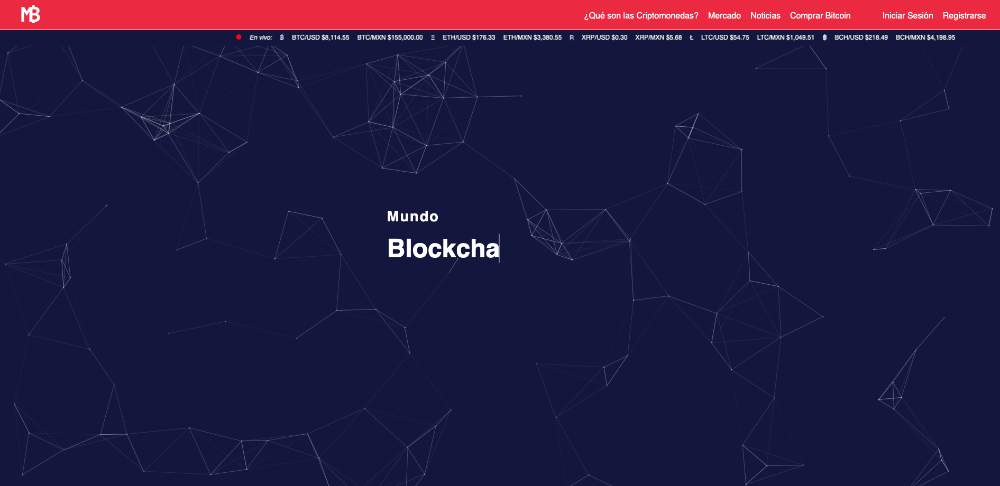
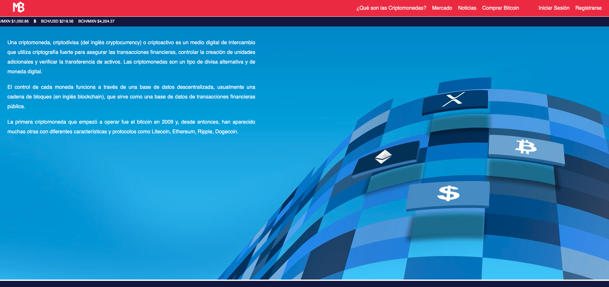
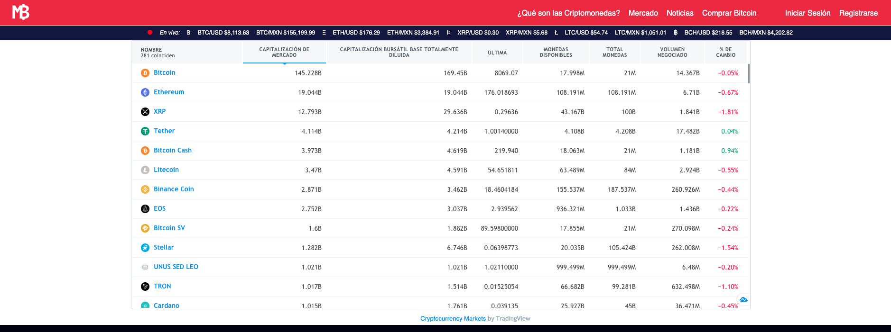
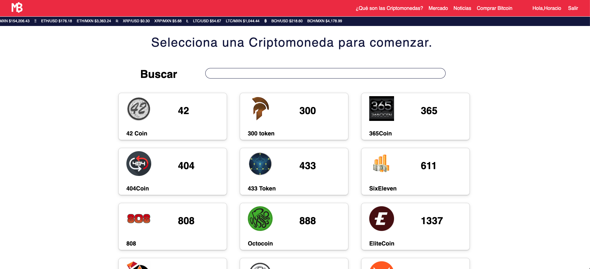
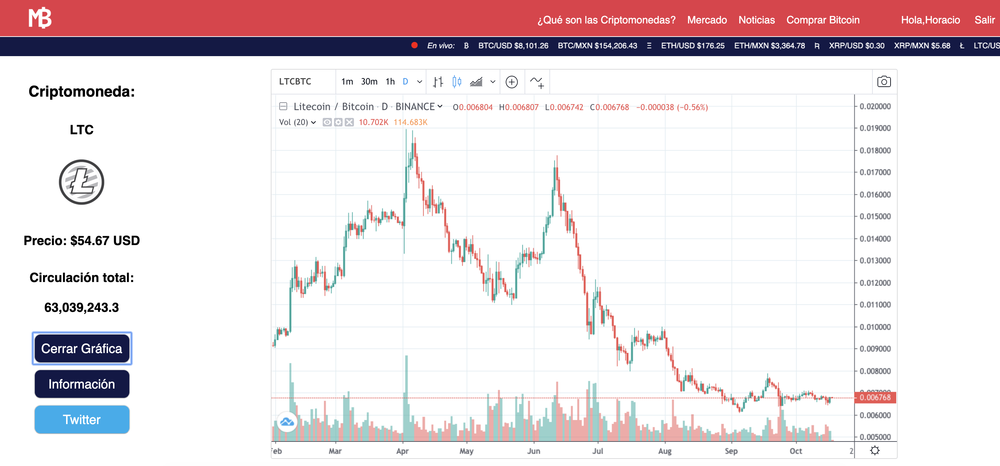
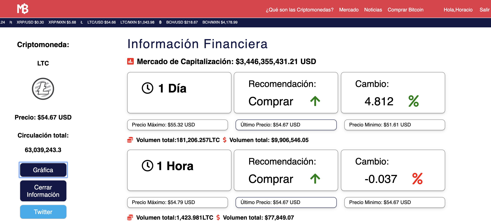

Ironhack México final project: Develop a Full Stack Web application MERN (MondoDB, Express, React, Node)

Mundo Blockchain: http://mundoblockchain.site

It is a web application that allows all cryptocurrency lovers to have all the necessary information to be able to make 
better purchasing decisions in an orderly environment, regardless of whether you only have a few dollars invested or 
thousands invested.

From news in English or Spanish, a list of the main cryptocurrencies, graphic so you can do a technical analysis without leaving the portal to a purchase prediction in up to 5000 different cryptocurrencies.

  

  

  

<h2>Sign up and create a user to check finacial information of more than 5,000 cryptocurecies</h2>

  
  
  

